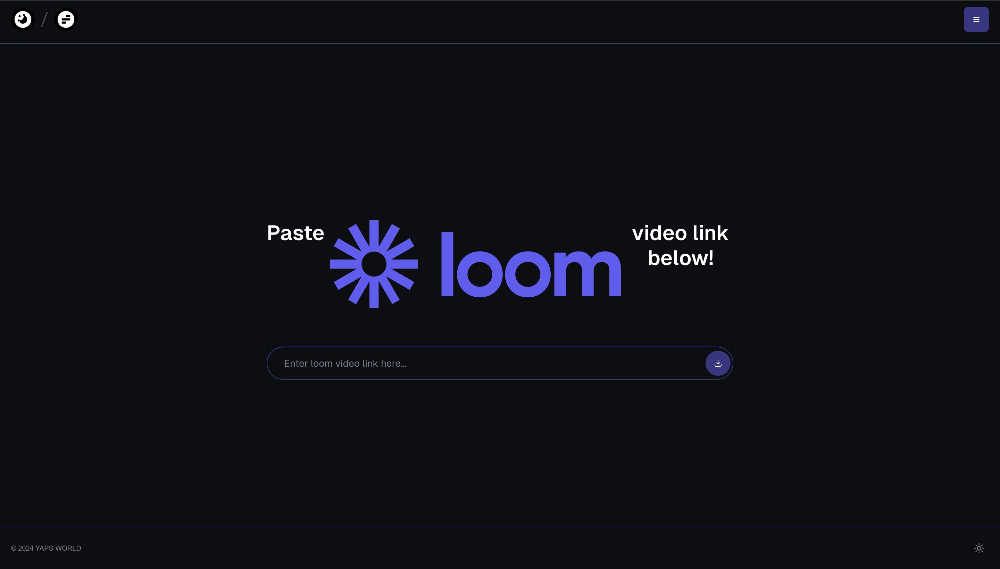

<div align="center" style="padding: 10px; border: 1px solid #ccc; background-color: #f9f9f9; border-radius: 10px; margin-bottom: 20px;">
    <h2 style="margin: 0; font-size: 24px; color: #333;">lovido v2 is out now! 🎉</h2>
    <p style="margin: 5px 0 0 0; font-size: 16px; color: #666;">Read all about it on <a href="https://www.linkedin.com/in/abdibrokhim/" style="text-decoration: underline; color: #1a73e8;"> LinkedIn</a>!</p>
</div>

<!-- markdownlint-disable MD030 -->

# [](https://lovido.lol)

<p align="center"><strong>
    Download your Loom videos with lovido! 🚀
</strong></p>
<p align="center"><strong>
    Iit's FREE. 💜 
</strong></p>
<p align="center"><strong>
    it's Open Source. 🌟
</strong></p>


## 🚀 Watch the video
How to download your Loom videos with lovido (Loom Video Downloader)

[](https://youtu.be/wyp8tRTLLfQ?si=GXlfNcXuF2qOeSsO)

### Try it now [lovido.lol](https://lovido.lol)

### 🚀 Powered by AI/ML API
With AI/ML API I can access to over 200 AI models with one API endpoint. It's super cool! Now I can switch between models with just one click. 🔥 [Here's is how... click me](https://aimlapi.com/?via=ibrohim)

## 📦 Run Locally

Clone the repository with:

```shell
git clone https://github.com/abdibrokhim/loom-dl-web
```

Install the dependencies with:

```shell
npm install
```
and 

Run the development server with:

```shell
npm run dev
```
Open http://localhost:3000 in your browser.

## 🦄 Important

if it was useful. Please consider [donate](https://buymeacoffee.com/abdibrokhim/) and i will buy custom domain for this project.

## 🥂 Discord bot

Join our community Discord server [Open Community](https://discord.gg/nVtmDUN2sR)

## 🐞 Bug report or Feature request

Message me at abdibrokhim@gmail.com

## 👋 Want to Contribute?

Kindly check the [CONTRIBUTING.md](https://github.com/abdibrokhim/loom-dl-web/blob/main/CONTRIBUTING.md)

## ⭐️ Star History

[](https://star-history.com/#abdibrokhim/loom-dl-web&Date)

## 🙏 Support

If you wish to support further development and feel extra awesome, you can [donate](https://buymeacoffee.com/abdibrokhim/), become a [Patron](https://www.patreon.com/abdibrokhim) or [follow on LinkedIn](https://www.linkedin.com/in/abdibrokhim/).

## 🦄 Want to learn build stuff from coool guy?

Here's my topmate profile https://topmate.io/join/abdibrokhim book session with me. it's Absolutely FREE! 🎉 (free services for everyone , i want to help as much as people possible, so far i could help 200K developers, let's goooooo, [imcook.in](https://imcook.in))